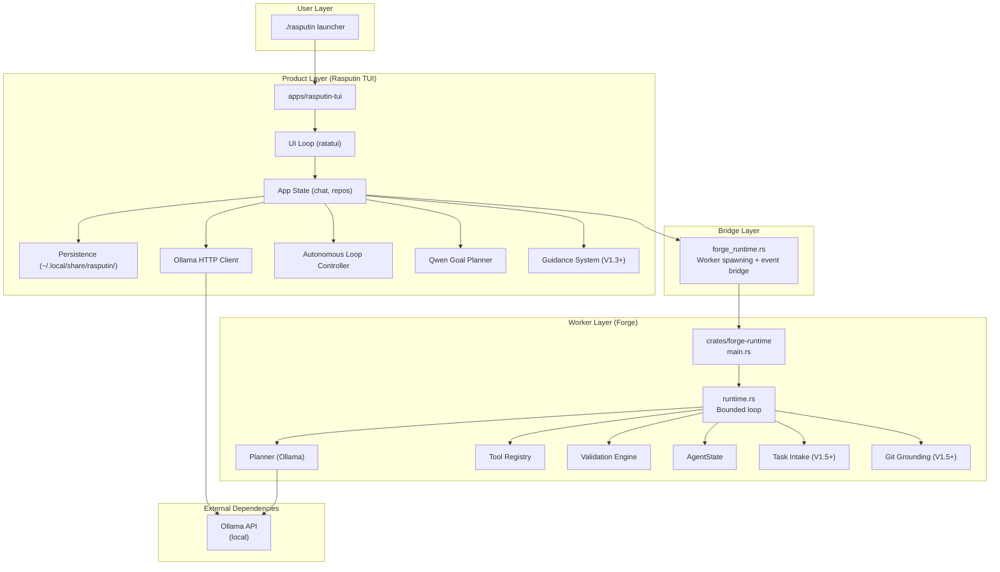
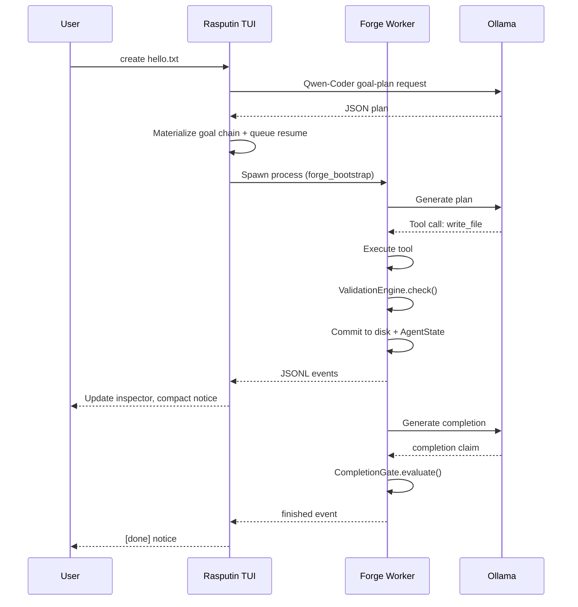

# Rasputin Architecture

## System Overview

Rasputin is a multi-layered system with clear separation between user-facing product code and bounded execution engines. The architecture prioritizes **failure isolation**, **deterministic execution**, **audit-grounded truth**, and **runtime truth over documentation**.

## System Truth Layers (V1.6)

Rasputin operates on five layers of authoritative truth, each serving a distinct purpose:

```
┌─────────────────────────────────────────────────────────────────┐
│  LAYER 5: CHECKPOINT TRUTH                                      │
│  Validated, resumable execution state with workspace integrity  │
│  → Durable snapshots for crash/restart recovery                 │
├─────────────────────────────────────────────────────────────────┤
│  LAYER 4: REPLAY TRUTH                                          │
│  Deterministic reconstruction from audit events only            │
│  → Validates audit log completeness                           │
├─────────────────────────────────────────────────────────────────┤
│  LAYER 3: AUDIT TRUTH                                           │
│  Immutable append-only execution timeline                       │
│  → Historical record of all transitions and outcomes            │
├─────────────────────────────────────────────────────────────────┤
│  LAYER 2: PROGRESS TRUTH                                        │
│  Canonical ExecutionState via reducer transitions               │
│  → In-flight execution progress                                 │
├─────────────────────────────────────────────────────────────────┤
│  LAYER 1: OUTCOME TRUTH                                       │
│  Single authoritative ExecutionOutcome per chain              │
│  → Terminal success/failure/warning state                       │
└─────────────────────────────────────────────────────────────────┘
```

**Critical Invariant**: Each layer must derive from the layer below. UI NEVER invents truth independently.

| Layer | Source | Immutable | Used By |
|-------|--------|-----------|---------|
| ExecutionOutcome | Chain aggregation | Yes (once finalized) | UI status, completion reporting |
| ExecutionState | `reduce_execution_state()` | No (transitions) | Progress tracking, UI indicators |
| AuditLog | Runtime events | Yes (append-only) | Replay engine, inspector, forensics |
| ReplayResult | `replay_audit_log()` | Yes (deterministic) | Validation, divergence detection |
| Checkpoint | Validated boundary state | Yes (snapshots) | Resume after crash/restart |



## Layer Descriptions

### 1. Bootstrap Layer
- **Launcher**: `./rasputin` bash script
- **Entrypoint**: `apps/rasputin-tui/src/main.rs`
- **Purpose**: Terminal setup, logging initialization, async runtime entry

### 2. Product Layer (Rasputin TUI)
Located in `apps/rasputin-tui/`:

| Module | Purpose | Truth Layer |
|--------|---------|-------------|
| `main.rs` | Async entry, terminal backend setup, main event loop | - |
| `app.rs` | App state management, command routing, repo attachment, chain orchestration, Forge handoff | - |
| `state.rs` | **Canonical reducer**, `ExecutionState` transitions, `ExecutionOutcome` authority | Layer 1 & 2 |
| `persistence.rs` | JSON serialization; **CheckpointManager**, **AuditLog** storage; chain orchestration | Layer 3 & 5 |
| `autonomy.rs` | Goal lifecycle policy, autonomous start decisions | - |
| `goal_planner.rs` | Qwen-Coder goal-plan prompt and JSON normalization | - |
| `ollama.rs` | HTTP client for Ollama chat API (loopback-only) | - |
| `forge_runtime.rs` | Worker spawning, JSONL event parsing, runtime bridge | - |
| `commands.rs` | Slash command parsing | - |
| `ui/` | Ratatui rendering: layout, panels, widgets | Renders from Layers 1-3 |
| `validation.rs` | TUI-local validation pipeline | - |

#### UI/UX Architecture: Normal vs Operator Mode

The TUI implements a dual-mode experience model:

**Normal Mode** (default for daily users):
- **Inspector**: Hidden by default; manual toggle only
- **Status Bar**: Human-readable language ("Working...", "Step 2 of 5", "Ready")
- **Composer**: Conversational hints ("Describe what you want to change...")
- **Mode Toggle**: Hidden; simplified intent-based indicators
- **Goal**: Reduce cognitive load, hide debug machinery

**Operator Mode** (for debugging/audit):
- **Inspector**: Auto-shows during execution
- **Status Bar**: Technical details (Chain IDs, Git SHAs, exact states)
- **Composer**: Full [CHAT] [EDIT] [TASK] mode buttons with command syntax hints
- **All Audit Surfaces**: Logs, Audit tab, Context tab, full technical details
- **Goal**: Full visibility into system internals

**Toggle**: Sidebar "View" section provides mode switch and inspector controls.

**Architectural Invariant**: UI NEVER invents truth independently. Both modes render from the same truth layers; only the presentation differs.

### 3. Bridge Layer
- **File**: `apps/rasputin-tui/src/forge_runtime.rs`
- **Purpose**: Spawns `forge_bootstrap` worker process, consumes JSONL events, converts to TUI runtime events

### 4. Worker Layer (Forge)
Located in `crates/forge-runtime/`:

| Module | Purpose |
|--------|---------|
| `main.rs` | CLI parsing, `RuntimeConfig` construction, `run_bootstrap()` entry |
| `runtime.rs` | Bounded planner/executor loop, integrity checks, repair logic |
| `planner/` | LLM planner implementations, prompt assembly |
| `tool_registry.rs` | Tool registration and resolution |

## Checkpoint/Resume Architecture (Phase D)

The checkpoint system provides durable, validated execution snapshots for restart/crash recovery:

### Checkpoint Structure

```rust
struct ExecutionCheckpoint {
    checkpoint_id: String,           // Unique identifier
    chain_id: String,                // Owning chain
    active_step: Option<usize>,      // Next step to execute
    lifecycle_status: ChainLifecycleStatus,
    aggregated_outcome: Option<ExecutionOutcome>,
    execution_state: ExecutionState,  // State at checkpoint boundary
    audit_cursor: usize,             // Last processed audit event
    workspace_hash: String,          // Blake3 hash of tracked files
    tracked_files: Vec<String>,      // Files included in hash
    validation_status: CheckpointValidationStatus,
    source: CheckpointSource,        // Why checkpoint was created
    created_at: DateTime<Local>,
    schema_version: u32,             // For backward compatibility
}
```

### Checkpoint Rules

**Creation (Safe Boundaries Only)**:
- ✓ After successful validated step completion
- ✓ At explicit safe halt
- ✓ At coherent approval pause
- ✗ NEVER mid-mutation
- ✗ NEVER on unvalidated failed mutation

**Resume Validation (Fail-Closed)**:
1. Schema version compatibility check
2. Workspace hash verification (detects stale checkpoints)
3. Audit cursor consistency check
4. Replay state vs checkpoint state comparison
5. Terminal chain detection (no resume from Complete/Failed/Archived)

### Storage Layout

```
~/.local/share/rasputin/
├── state.json                    # Main persistence
├── chains/
│   └── {chain_id}/
│       └── checkpoints/
│           └── chk-{chain_id}-{uuid}.json
└── ...
```

### Commands

| Command | Purpose |
|---------|---------|
| `/chain resume` | Resume with checkpoint validation |
| `/checkpoint list` | List all checkpoints with status |
| `/checkpoints` | Shorthand for list |
| `/audit replay` | Verify checkpoint consistency via replay |
| `tools/` | Tool implementations: file, search, execute, preview |
| `execution/validation_engine.rs` | Post-mutation validation: syntax, build, test |
| `state.rs` | `AgentState`: session identity, file tracking, change history |
| `governance.rs` | Runtime governance and drift logging |
| `types.rs` | Strongly-typed domain: `SessionId`, `ToolName`, `ExecutionMode` |
| `task_intake.rs` | Structured task classification and risk assessment (V1.5) |
| `git_grounding.rs` | Git status capture for task start checks (V1.5) |
| `guidance.rs` | Next Action Engine, risk forecasting |
| `approval_checkpoint.rs` | Checkpoint management for approval flows (V1.5) |
| `chain_executor.rs` | Multi-step chain execution |
| `chain_registry.rs` | Chain persistence and lifecycle management |

## Data Flow

### Startup Flow
```
./rasputin [workspace]
  └── cargo run -p rasputin-tui -- [workspace]
      └── App::new() loads PersistentState
          └── App::initialize() attaches workspace
              └── Event loop starts
```

### Chat Flow
```
User input → submit_active_input()
  └── Question-like text → OllamaClient::chat()
      └── HTTP POST to Ollama
          └── Response appended to transcript
```

### Autonomous Goal Flow
```
Task-like plain text or /goal → Command::Goal
  └── QwenGoalPlanner builds repo-grounded JSON request
      └── Ollama/Qwen-Coder returns plan JSON
          └── Normalized into GeneratedPlan (heuristic fallback on failure)
              └── GoalConfirm materializes PersistentChain
                  └── AutonomousLoopController enables bounded auto policy
                      └── Pending /chain resume active
                          └── Forge executes step → validation → feedback
                              └── try_auto_resume_chain() continues while policy allows
```

### Forge Task Flow
```
/task command → start_execution_task()
  └── Build ForgeConfig
      └── ForgeRuntimeHandle::run_task()
          └── Spawn forge_bootstrap process
              └── run_bootstrap(config)
                  └── Bounded loop (max 10 iterations)
                      └── Planner generates → CanonicalOutputAdapter validates
                          └── Tool executes → ValidationEngine validates
                              └── Commit or Revert
                                  └── JSONL events → TUI inspector
```

### Chain Resume Flow (V1.5)
```
/chain resume <id> → Command handler
  └── Load chain from PersistentState
      └── Policy check (max_steps, halt_on_failure)
          └── Risk preview with critical risk detection
              └── Find next pending step
                  └── Convert step → task description
                      └── Update chain status to Running
                          └── Store chain context (chain_id, step_id)
                              └── start_execution_task()
                                  └── Spawn forge_bootstrap process
                                      └── Execute step → result
                                          └── Update step with result
                                              └── try_auto_resume_chain() if enabled
```

## Key Architectural Decisions

### Process Isolation
- Each Forge task spawns a **new process**
- Worker death does not corrupt TUI state
- Clean resource lifecycle via process termination
- No shared memory between TUI and workers

### Bounded Execution
- Hard iteration limit (default 10)
- Temperature clamped to 0.0-0.1
- Deterministic seed (default 42)
- Repair loop limited to 3 retries

### Validation Gates
- Syntax check (Python, JS/TS, Rust)
- Format check (cargo fmt --check, npm run format:check)
- Lint check (cargo clippy, eslint, npm run lint)
- Build check (cargo, npm, tsc, python compileall)
- Test check (cargo test, npm test, pytest)
- **Fail-closed**: Any validation stage failure triggers automatic revert

### State Separation
| State | Owner | Persistence |
| State | Owner | Persistence |
|-------|-------|-------------|
| Chat messages | Rasputin TUI | `~/.local/share/rasputin/state.json` |
| Repo attachment | Rasputin TUI | `~/.local/share/rasputin/state.json` |
| Forge session | Forge worker | In-memory only (per task) |
| File mutations | Forge worker | Disk + `AgentState.change_history` |
| Goal lifecycle | Rasputin TUI | In-memory goal manager, linked to persistent chains |
| Chain definition | Rasputin TUI | `~/.local/share/rasputin/state.json` |
| Chain steps | Rasputin TUI | `~/.local/share/rasputin/state.json` |
| Chain policy | Rasputin TUI | `~/.local/share/rasputin/state.json` |
| Active chain | Rasputin TUI | `~/.local/share/rasputin/state.json` |
| Interrupt context | Rasputin TUI | In-memory (session-only) |

## Component Interaction



## Non-Goals

The architecture explicitly does NOT provide:
- A single shared in-memory state model for chat and Forge workers
- Daemon/background process management
- Cloud API connectivity
- Per-action approval in hot path (chain-level only)
- Automatic *unbounded* task continuation (chains are autonomously self-propelling within policy bounds, not unbounded daemons)
- Multi-process parallel execution

## TUI Usability Constraints

The terminal UI operates under specific constraints that shape the user experience:

| Constraint | Rationale |
|------------|-----------|
| **No mouse-required interactions** | All features accessible via keyboard for terminal purists |
| **80-column minimum width** | Sidebar (20) + Main (40) + Optional Inspector (20) |
| **Single-window focus** | No popups, modals, or floating dialogs; all UI in main frame |
| **Progressive disclosure** | Normal mode shows minimal UI; Operator mode reveals all |
| **Immediate feedback** | User input echoed immediately; execution status shown in status bar |
| **No background animations** | Terminal-friendly, no spinner animations that consume cycles |

**Accessibility**: Terminal-native means screen-reader compatible by default. No custom widget toolkit accessibility layers needed.

## Security Architecture

### Local-Only Ollama Constraint

The Ollama HTTP client is **architecturally restricted** to loopback addresses only:

```rust
// From ollama.rs - enforced at client construction
assert!(
    endpoint.starts_with("http://127.0.0.1:")
        || endpoint.starts_with("http://[::1]:")
        || endpoint.starts_with("http://localhost:"),
    "Ollama endpoint must be loopback-only"
);
```

**Implication**: Remote Ollama endpoints are **rejected at runtime**. The system is physically incapable of calling cloud LLM APIs (OpenAI, Anthropic, etc.).

### Repository Boundary Enforcement

All file operations validate paths against the repository root:

```rust
// From file_tools.rs
fn validate_path_boundary(path: &Path, working_dir: &Path) -> Result<PathBuf, ForgeError>
```

- Path traversal attacks (`../..`) are blocked
- Operations outside repo boundary are rejected
- Canonicalization ensures no symlink escapes

### Command Execution Safety

Shell commands are restricted via allowlisting:

- **Safe commands**: cargo, npm, python, git (read-only), make, etc.
- **Destructive commands**: rm, del, etc. require explicit confirmation
- **Destructive git subcommands**: push, reset, clean, etc. require confirmation
- **Timeout enforcement**: All commands have execution time limits
- **Output limits**: Prevents memory exhaustion from verbose commands

## Chain Architecture (V1.5)

### Chain Lifecycle
```
Draft → Ready → Running ─┬─► Complete
                         ├─► Failed
                         ├─► Halted (operator intervention or policy)
                         ├─► WaitingForApproval
                         └─► [auto-resume] ──► Running (if auto_resume enabled)

Archived (terminal state, manually set)
```

### Policy Enforcement
| Policy | Default | Behavior |
|--------|---------|----------|
| max_steps | 100 | Hard limit on total steps per chain |
| halt_on_failure | true | Stop chain on any step failure |
| require_validation_each_step | true | Require validation gate per step |
| max_consecutive_failures | 3 | Halt after N consecutive failures |
| auto_resume | false | Auto-trigger /chain resume on step completion |

### Risk Forecasting (V1.5)
Before chain resume, the system:
1. Previews upcoming steps
2. Detects risks (GitConflict, ValidationFailure, etc.)
3. Classifies risk level (Safe → Caution → Warning → Critical)
4. **Blocks execution on critical risks** unless `--force` flag provided
