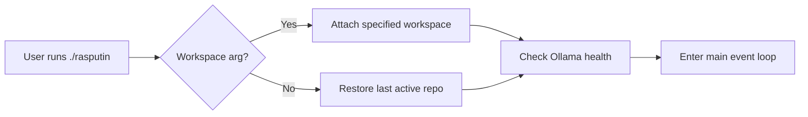
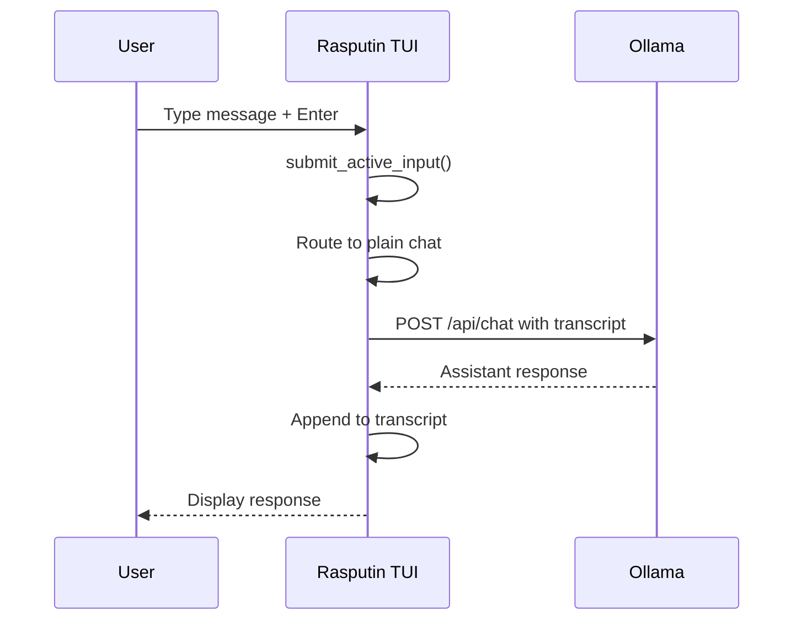
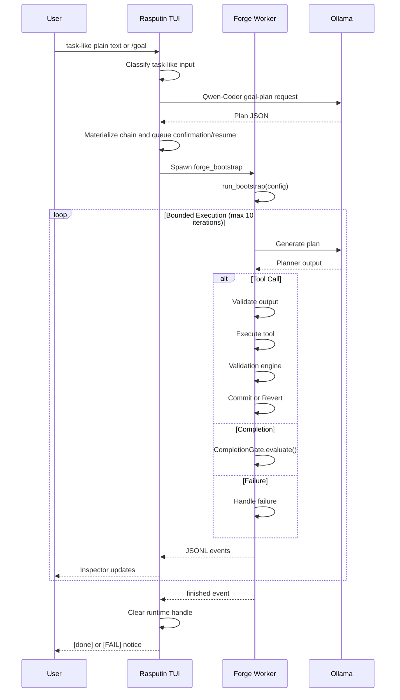
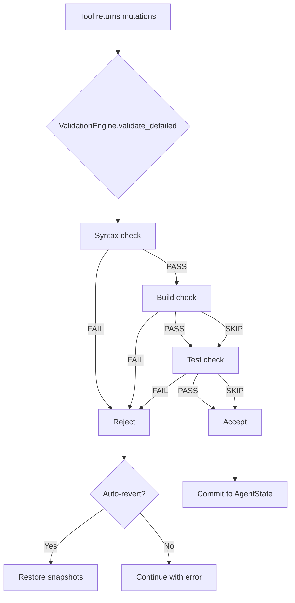
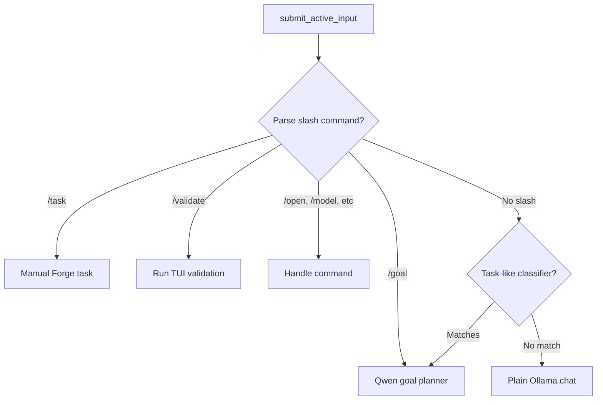

# Rasputin Main Workflows

## Startup Workflow



**Key files**: `rasputin` (launcher), `apps/rasputin-tui/src/main.rs`, `apps/rasputin-tui/src/app.rs`

## Plain Chat Workflow



**Prerequisites**: Repo attached, Ollama connected, model available

## Autonomous Goal And Forge Task Workflow

### High-Level Flow



### Detailed Iteration Flow

```
Iteration N:
1. Verify state integrity (hash check)
2. Check iteration limit
3. Build StateView from AgentState
4. Call planner.generate_raw()
5. CanonicalOutputAdapter::process()
   - Accept: Parse and execute
   - Normalize: Fix minor issues, proceed
   - Reject: Trigger repair loop
   - Escalate: Halt execution
6. Execute tool (if tool_call)
7. Run validation engine (if mutations)
8. Commit or revert based on validation
9. Emit JSONL events
10. Continue, complete, or fail
```

## Risk Preview Workflow (V1.5)

```
/chain resume or /preview
  └── Load chain from persistence
      └── Preview upcoming steps
          └── Detect risks for each step
              └── Classify risk level
                  └── If critical risks found:
                      └── Block execution
                          └── Show risk summary
                              └── Require --force to proceed
                  └── If no critical risks:
                      └── Show preview with warnings
```

### Risk Types Detected

| Risk | Level | Blocks Execution |
|------|-------|------------------|
| GitConflict | Critical | Yes |
| ValidationFailure | Warning | No |
| MissingContext | Caution | No |
| ApprovalRequired | Warning | No |

## Interrupt Handling Workflow (V1.5)

```
User: /stop or Ctrl+C
  └── Signal to Forge worker
      └── Worker emits failure events
          └── Update step status to Failed
              └── Persist interrupted state
                  └── Show interrupt notice
                      └── User: /chain resume
                          └── Restore from interrupted state
                              └── Continue from next step
```

## Chain Management Workflows

### Chain Lifecycle

```mermaid
flowchart TB
    subgraph Create["Chain Creation"]
        A[User: task-like text or /goal] --> B[Qwen-Coder plan]
        B --> C[Create planned chain]
        C --> E[Set chain active]
        E --> F[Persist state]
    end

    subgraph Execute["Chain Execution"]
        G[GoalConfirm or /chain resume <id>] --> H{Policy check}
        H -->|Pass| I[Find next step]
        H -->|Fail| J[Reject: max_steps exceeded]
        I --> K[Update status: Running]
        K --> L[Spawn Forge worker]
        L --> M[Execute step]
        M --> N{Result}
        N -->|Success| O[Mark step complete]
        N -->|Failure| P{halt_on_failure?}
        P -->|Yes| Q[Mark chain Halted]
        P -->|No| R[Mark step failed, continue]
        O --> S[Persist state]
        Q --> S
        R --> S
    end

    subgraph Archive["Chain Archive"]
        T[User: /chain archive <id>] --> U{Chain running?}
        U -->|Yes| V[Reject: cannot archive running]
        U -->|No| W[Mark archived]
        W --> X[Clear active if needed]
        X --> Y[Persist state]
    end
```



### Chain Commands

| Command | Purpose | State Change | Persistence |
|---------|---------|--------------|-------------|
| `/chains` | List active chains | None | - |
| `/chain status [id]` | Show chain details | None | - |
| `/chain switch <id>` | Set active chain | `active_chain_id` | Yes |
| `/chain archive <id>` | Archive chain | `archived=true`, `status=Archived` | Yes |
| `/chain resume <id>` | Resume execution | `status=Running`, step executed | Yes |
| `/resume`, `/continue` | Resume active chain | Same as above | Yes |
| `/plan` | Show step plan | None | - |
| `/preview` | Preview chain with risk forecast | None | - |
| `/stop` | Interrupt current execution | Step marked Failed | No |
| `/plan context` | Show context files | None | - |
| `/plan checkpoints` | Show checkpoint plan | None | - |

### Chain Persistence Flow

```
Any chain command
  └── Command handler
      └── Mutate PersistentState
          ├── Update chains vector
          ├── Modify active_chain_id (if switch)
          ├── Update chain status (if resume/complete)
          ├── Advance active_step (if step completes)
          └── Update step result (if execution finishes)
              └── self.persist().await
                  └── Serialize to ~/.local/share/rasputin/state.json
                      └── State survives restart
```

### Auto-Resume Workflow (V1.5)

```
Step completes successfully
  └── Persist step result
      └── Check ChainPolicy.auto_resume
          └── If enabled and policy bounds not exceeded:
              └── Trigger auto-resume
                  └── Start next step execution
          └── If disabled:
              └── Wait for manual /chain resume
```

### Conversation-to-Chain Binding

```
/chain switch <id>
  └── Set persistence.active_chain_id = id
      └── If persistence.active_conversation exists
          └── Find conversation in persistence.conversations
              └── Set conversation.chain_id = id
                  └── Now: Conversation ↔ Chain binding established
```

## Validation Workflow

### Forge Runtime Validation (per task)



**Note**: Lint stage is skipped in current runtime policy.

### Git Grounding Check (V1.5)

Before task execution, Git status is captured:

```
Task start
  └── GitGrounding::from_repo()
      └── Capture branch, commit, dirty status
          └── TaskStartChecker::check()
              └── If dirty worktree and policy requires approval:
                  └── Show warning or require approval
```

### TUI `/validate` Workflow

```
/validate command
  └── Run TUI-local pipeline
      ├── Syntax check
      ├── Lint check (if available)
      ├── Build check (if available)
      └── Test check (if available)
          └── Update shared validation tab
```

**Important**: `/validate` is separate from Forge runtime validation. They may disagree.

## Repo Attachment Workflow

```
User: /open /path/to/repo
  └── App::handle_command(OpenRepo)
      └── Repo::attach()
          ├── Validate path exists
          ├── discover_workspace_model()
          │   ├── Check .forge/config.yaml
          │   ├── Check .forge/config.yml
          │   └── Check rasputin.json
          ├── Update recent repos list
          └── Persist state
```

## Recovery Workflow (Task Failure)

```
Forge task fails
  └── Worker emits failure events
      └── TUI displays [FAIL] notice
          └── User recovery options:
              ├── Review Failure tab (auto-focused)
              ├── Review Logs tab for error details
              ├── Review files on disk
              ├── Run /validate for extra checks
              ├── Use /replay to compare runs
              └── Rewrite the goal and rerun through task-like text, /goal, or /task
```

### Structured Task Intake (V1.5)

Freeform requests are classified:

```
task-like plain text or /goal <freeform request>
  └── AutonomousLoopController::is_task_like_plain_text()
      └── QwenGoalPlanner::build_messages()
      └── QwenGoalPlanner::parse_response()
      └── GoalConfirm materializes PersistentChain
      └── Pending /chain resume active

/task <freeform request> (legacy/manual)
  └── TaskIntakeClassifier::classify()
      └── Determine task class and risk
          └── Check ExecutionRiskPolicy
              └── If approval required: insert checkpoint
              └── If clarification needed: request clarification
              └── Otherwise: proceed with classified mode
```

### Approval Checkpoint Workflow (V1.5)

```
High-risk task detected
  └── Insert ApprovalCheckpoint
      └── Pause execution
          └── TUI shows checkpoint view
              └── Operator approves or denies
                  └── If approved: continue execution
                  └── If denied: halt with revert (fail-closed)
```

## Input Routing Workflow



**Task-like classifier**: Action verbs such as fix, implement, create, refactor, add, update, modify, change, build, test, validate, harden, integrate, and phrases such as "can you fix" or "please add".

## Event Flow (During Forge Execution)

```
Worker process
  └── Writes JSONL to stdout
      └── TUI reads via spawned process
          └── forge_runtime.rs parses
              └── Converts to RuntimeEvent
                  └── App::poll_execution_events()
                      └── UI re-renders with new state
```

### Event Translation (Backend → UI)

| Backend Event | UI Surface | User Meaning | User Action |
|--------------|------------|--------------|-------------|
| `RUNTIME_INIT` | Runtime tab: `init` | Forge worker started | Wait |
| `ITERATION_START` | Runtime tab: `iteration / N` | New planning loop started | Wait |
| `PLANNER_OUTPUT` | Runtime tab: `planner / tool_call` or `planner / completion` | Planner produced output | Watch for next action |
| `PROTOCOL_VALIDATION_ACCEPT` | Validation tab `Protocol` → passed | Planner output structurally valid | Normal |
| `TOOL_EXECUTE` | Runtime tab: `tool / <name>` | Tool is running | Watch files |
| `TOOL_SUCCESS` | Runtime/logs | Tool returned successfully | Expect validation |
| `MUTATIONS_DETECTED` | Runtime tab: `mutation / N` | File changes detected | Validation is next |
| `VALIDATION_STAGE` | Validation rows: `Syntax`, `Build`, `Test` | Specific stage running | Watch for failures |
| `VALIDATION_ACCEPT` | Validation tab `Runtime` → passed | Mutations accepted | Expect commit |
| `STATE_COMMITTED` | Runtime tab: `commit / N` | Changes committed to disk | Review diff |
| `COMPLETION_GATE_ACCEPT` | Runtime tab `completion` | Task completing | Task is about to finish |
| `REPAIR_LOOP_ACTIVE` | Runtime tab: `repair / attempt` | Retrying after failure | Wait or expect failure |
| `RUNTIME_ERROR` | Logs error, final failure notice | Run failed definitively | Inspect logs, fix, rerun |
| `RUNTIME_COMPLETE` | Final finished state | Worker reached terminal state | Read final notice |

### Failure Translation

| Failure Condition | User Sees | Meaning | Action |
|------------------|-----------|---------|--------|
| No repo attached | Footer block reason | Chat blocked | `/open <path>` |
| Ollama disconnected | Footer block | Model unavailable | Restore Ollama |
| Protocol rejection | Validation `Protocol` fails | Planner output rejected | Wait for repair or rerun |
| Runtime validation reject | Validation `Runtime` fails | Mutations rejected | Inspect files, rerun |
| Repair loop exhausted | Final failure notice | Retries didn't recover | Rewrite task |
| Second `/task` during active run | Start fails | One Forge runtime at a time | Wait for current run |

### Auto-Revert Reality

Forge reverts rejected mutations internally, but the TUI does **not** expose a dedicated `changes reverted` event. The user sees:
- Failed validation row
- Error logs
- Final failure notice
- On-disk files reflecting reverted state

## Persistence Workflows

### Save (On Change)
```
State change
  └── PersistentState updated
      └── Serialize to JSON
          └── Write to ~/.local/share/rasputin/state.json
```

### Load (On Startup)
```
App::new()
  └── PersistentState::load()
      └── Read ~/.local/share/rasputin/state.json
          └── Deserialize or create new
              └── Restore conversations, repos, model status
```

### Session Restore Nuances
- **Restored**: Transcript messages, conversation list, archived status, recent repos
- **NOT restored**: Runtime tab entries, validation progress, Forge worker state, logs from old runs
